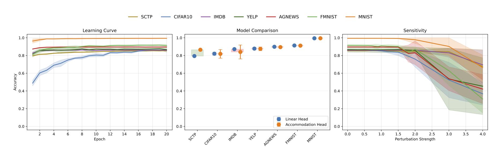

# Experimental Sandbox for the Accommodation Layer



This repository provides a reproducible experimental framework associated with the research paper: **“Making Latent Space Reorganisation Observable in Deep Neural Networks”**.

The codebase implements and evaluates two families of models:

- **Linear head models** 
- **Accommodation head models**

The goal of the experimental suite is to systematically analyze and compare these approaches across multiple data modalities, including:

- **Vision datasets**: MNIST, CIFAR10, FMNIST  
- **Text datasets**: IMDB, AGNEWS, YELP
- **Tabular datasets**: SCTP  

All experiments are designed with reproducibility in mind, enabling controlled evaluation across seeds, datasets, and model configurations.

---

## Datasets

Most datasets used in this project are publicly available on Kaggle:

https://www.kaggle.com/datasets/accommodationpaper/accommodation-paper-datasets

#### Dataset structure

All datasets must be placed inside a local directory (by default `./datasets`) before running any experiment. The framework expects a fixed file naming convention, so files must be renamed accordingly.

Example directory structure:

```
datasets/
├── AGNews_dataset.csv
├── IMDB_dataset.csv
├── YELP_dataset.csv
├── SCTP_dataset.csv
```

#### Important notes

- The `--data-path` argument must point to the directory containing these files (e.g. `./datasets`)
- File names are case-sensitive and must match exactly:
  - `AGNews_dataset.csv`
  - `IMDB_dataset.csv`
  - `YELP_dataset.csv`
  - `SCTP_dataset.csv`
- If filenames differ, the data loader will not detect them
- Visual datasets are directly downloaded via Pytorch API

#### Santander Customer Transaction Prediction (SCTP)

Due to licensing constraints, the Santander Customer Transaction Prediction dataset is not distributed in this repository and must be downloaded manually from the official Kaggle competition:

https://kaggle.com/competitions/santander-customer-transaction-prediction

To obtain the dataset:

1. Create a Kaggle account (if you don’t already have one) and **register for the competition**.  
2. Accept the competition rules to gain access to the data.  
3. Navigate to the **Data** section and download the file:
```
train.csv
```
4. Rename the downloaded file to:
```
SCTP_dataset.csv
```
5. Place it inside the `datasets/` directory.

After completing these steps, the dataset will be ready to use in this project.

```bibtex
@misc{santander-customer-transaction-prediction,
    author = {Mercedes Piedra and Sohier Dane and Soraya_Jimenez},
    title = {Santander Customer Transaction Prediction},
    year = {2019},
    howpublished = {\url{https://kaggle.com/competitions/santander-customer-transaction-prediction}},
    note = {Kaggle}
}
```

---

## Requirements

- Python ≥ 3.10
- PyTorch
- torchvision
- scikit-learn
- numpy
- pandas

Installation:

```
pip install -r requirements.txt
```

---

## Installation and Usage

To start running your own experiments, clone this repository and install it locally in editable mode:

```bash
git clone https://github.com/accommodation-paper/accommodation.git
cd accommodation
pip install -e .
````

This makes the package available for use, allowing experiments to be run directly. If you feel lost, start with the following command:

```bash
accommodation --help
```

You can also run the module interface to avoid using `pip install`:

```bash
python -m accommodation.main --help
```

## Accommodation Experiments

These experiments provide example configurations demonstrating how the Accommodation framework can be applied across different datasets and settings. They are intended as reproducible reference cases rather than an exhaustive set of evaluations, illustrating the flexibility of the approach under varying architectures, modalities, and training regimes. Users are encouraged to adapt and extend these setups to explore additional configurations and research questions.

#### SCTP (Accommodation Head)

```
accommodation --dataset SCTP \
  --data-path ./datasets \
  --type accommodation \
  --device cuda \
  --epochs 10 \
  --num-cycles 10 \
  --base-seed 42 \
  --num-classes 2 \
  --embedding-dim 200 \
  --num-potents-per-class 10 \
  --neutral-potents 10 \
  --negative-potents True \
  --latent-dim 30 \
  --plasticity False \
  --plasticity-gamma 5 \
  --differentiation-lambda 0.5 \
  --results-dir ./results \
  --input-dim 200
```


#### MNIST (Accommodation Head)

```
accommodation --dataset MNIST \
  --data-path ./datasets \
  --type accommodation \
  --device cuda \
  --epochs 20 \
  --num-cycles 10 \
  --base-seed 42 \
  --num-classes 10 \
  --embedding-dim 128 \
  --num-potents-per-class 10 \
  --neutral-potents 10 \
  --negative-potents True \
  --latent-dim 30 \
  --plasticity False \
  --plasticity-gamma 5 \
  --differentiation-lambda 0.5 \
  --results-dir ./results
```


#### CIFAR10 (Accommodation Head)

```
accommodation --dataset CIFAR10 \
  --data-path ./datasets \
  --type accommodation \
  --device cuda \
  --epochs 20 \
  --num-cycles 10 \
  --base-seed 42 \
  --num-classes 10 \
  --embedding-dim 256 \
  --num-potents-per-class 10 \
  --neutral-potents 10 \
  --negative-potents True \
  --latent-dim 30 \
  --plasticity False \
  --plasticity-gamma 5 \
  --differentiation-lambda 0.5 \
  --results-dir ./results
```

#### IMDB (Accommodation Head)

```
accommodation --dataset IMDB \
  --data-path ./datasets \
  --type accommodation \
  --device cuda \
  --epochs 20 \
  --num-cycles 10 \
  --base-seed 42 \
  --num-classes 2 \
  --embedding-dim 128 \
  --num-potents-per-class 5 \
  --neutral-potents 5 \
  --negative-potents True \
  --latent-dim 30 \
  --plasticity True \
  --plasticity-gamma 5 \
  --differentiation-lambda 0.5 \
  --results-dir ./results
```

#### SCTP (Linear Head)

```
accommodation --dataset SCTP \
  --data-path ./datasets \
  --type linear \
  --device cuda \
  --epochs 2 \
  --num-cycles 10 \
  --base-seed 42 \
  --num-classes 2 \
  --input-dim 200 \
  --latent-dim 30 \
  --results-dir ./results
```

#### CIFAR10 (Linear Head)

```
accommodation --dataset CIFAR10 \
  --data-path .datasets \
  --type linear \
  --device cuda \
  --epochs 20 \
  --num-cycles 10 \
  --base-seed 42 \
  --num-classes 10 \
  --embedding-dim 256 \
  --latent-dim 30 \
  --results-dir ./results
```

#### IMDB (Linear Head)

```
accommodation --dataset IMDB \
  --data-path .datasets \
  --type linear \
  --device cuda \
  --epochs 20 \
  --num-cycles 10 \
  --base-seed 42 \
  --num-classes 2 \
  --embedding-dim 128 \
  --latent-dim 30 \
  --results-dir ./results
```

---

## Output Structure

Each experiment run produces a structured set of outputs to ensure reproducibility, traceability, and ease of analysis across different seeds, datasets, and training cycles.

Results are stored under the following hierarchical structure:

```
results/
 ├── accommodation/
 │    └── DATASET/
 │         └── POLICY/
 │              └── POTENT_CONFIGURATION/
 │                   └── SEED/
 │                        ├── snapshot_01.pt
 │                        ├── snapshot_02.pt
 │                        ├── ...
 │                        └── snapshot_N.pt
 │
 │         ├── policy-*.json
 │
 ├── linear/
 │    └── DATASET/
 │         └── SEED/
 │              ├── cycle_0.pt
 │              ├── cycle_0.json
 │              ├── cycle_1.pt
 │              ├── cycle_1.json
 │              └── ...
```
